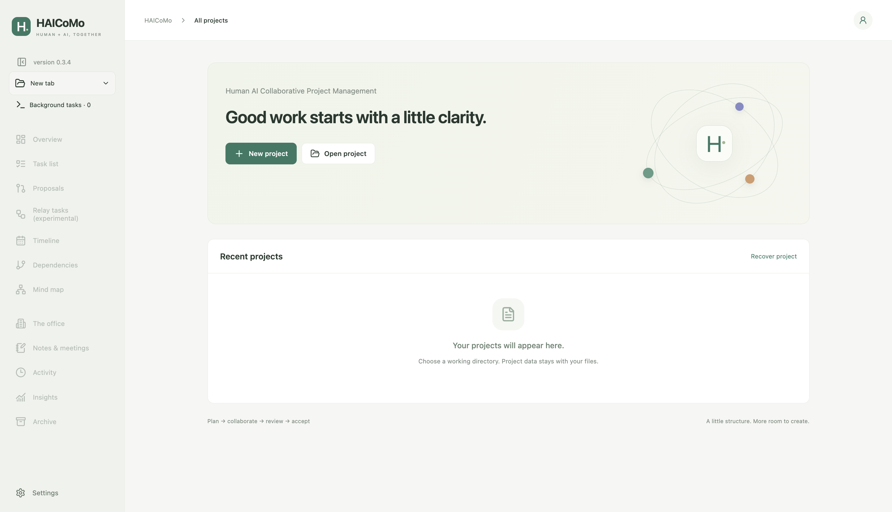
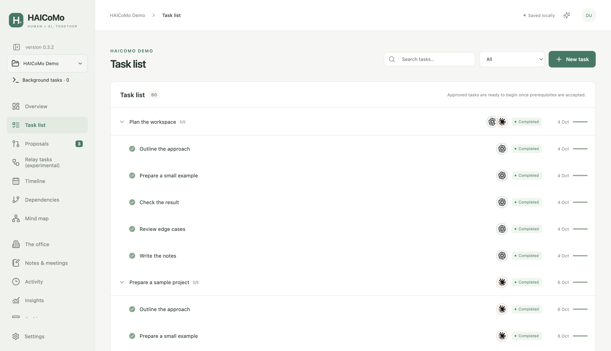
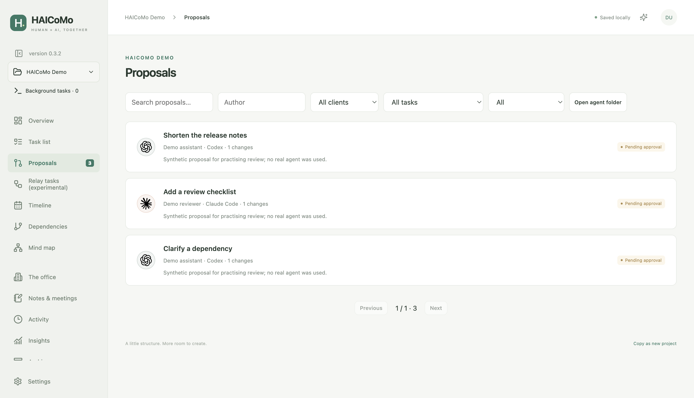
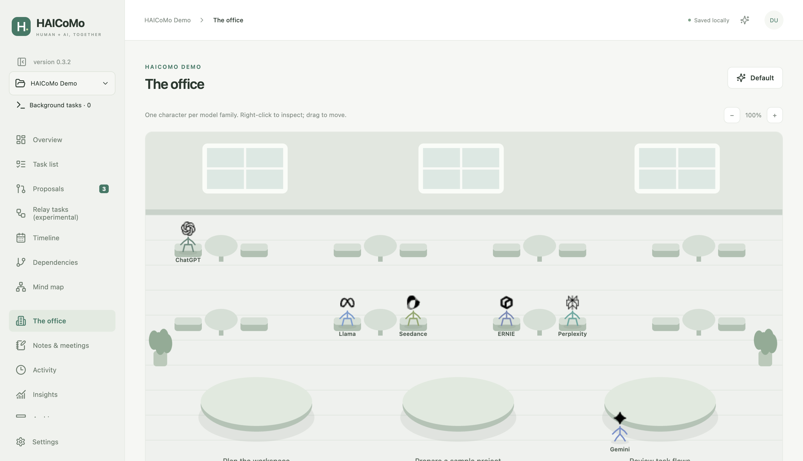
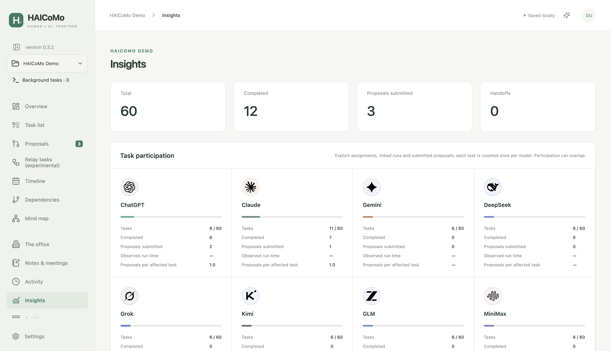
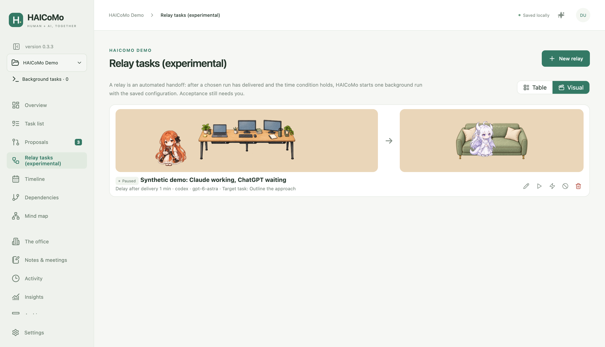
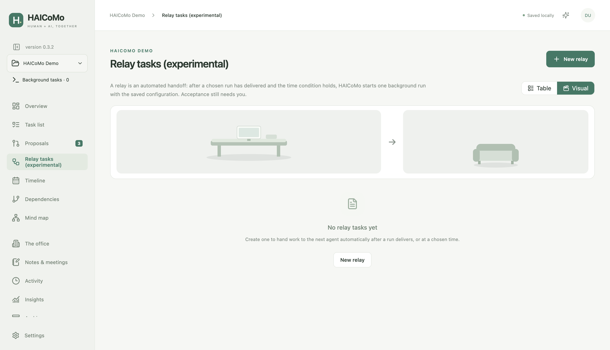
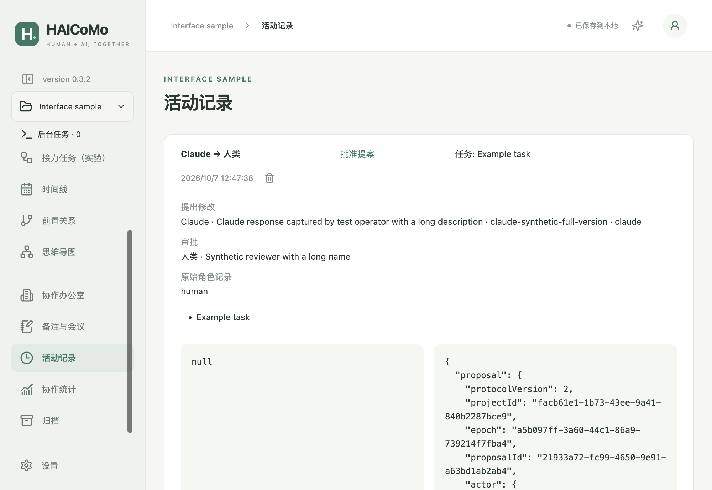

# HAICoMo

> [0.4.0 preview](https://github.com/jasonyao486/HAICoMo/releases/tag/v0.4.0) for Apple Silicon Mac and Windows x64: in-app updates, project search and the official WorkBuddy icon. See [release notes](docs/RELEASE-NOTES-0.4.0.md).

**English** · [简体中文](README.zh-CN.md)

A local desktop app for project management, human review, and collaboration with multiple AI agents. Agents propose changes; human users approve proposals and accept deliveries. Project data stays in the selected working directory.

The recommended preview is **0.4.0 for both platforms**: signed and notarised on Mac, installed per user on Windows. See [native verification](docs/TESTING-0.4.0.md). Historical versions and downloads remain available.

## Install and start

Task management requires no Node.js, Git or model subscription.

1. Open [Downloads and releases](https://github.com/jasonyao486/HAICoMo/releases). Select **v0.4.0 for either platform**, then expand **Assets**.
2. Choose the installer below. The “Source code” archives are for developers, not installers.

| Computer system | Download |
|---|---|
| Mac with an Apple M-series chip | [HAICoMo-0.4.0-arm64.dmg](https://github.com/jasonyao486/HAICoMo/releases/download/v0.4.0/HAICoMo-0.4.0-arm64.dmg) |
| Windows PC, System type “x64-based processor” | [HAICoMo-0.4.0-windows-x64-setup.exe](https://github.com/jasonyao486/HAICoMo/releases/download/v0.4.0/HAICoMo-0.4.0-windows-x64-setup.exe) |
| Intel Mac, Windows ARM64 or Linux | No verified installer in this release |

On a Mac, find the chip under **Apple menu → About This Mac**. On Windows, open **Settings → System → About → System type**.

3. **Mac:** open the DMG, drag HAICoMo into Applications, eject the disk image, then open HAICoMo from Applications. The formal package has Developer ID signing, Apple notarisation and stapled tickets. A normal downloaded-app **Open** confirmation may appear; **Open Anyway** is not required in the verified fresh-account test.
4. **Windows:** open the setup `.exe`, installation is automatic for the current user, then launch HAICoMo. Installation, upgrade and uninstall do not request elevation. This release is unsigned and Windows may show a publisher/SmartScreen warning; that warning is separate from administrator permissions. Check the source and supplied SHA-256 before choosing to continue; managed computers may require administrator approval.
5. If the app opens in Chinese, first choose **设置 (Settings) → 语言 (Language) → English (UK) → 保存修改 (Save changes)**. Select **New project**, choose an empty local folder and save the `.haicomo` entry. Add a task and a subtask. No AI account is required for this step.
6. When a delivery is ready, open its file from the task, inspect it, then choose **Accept delivery**. Agent completion alone does not accept work.

<details>
<summary>Check a download's SHA-256</summary>

Download the matching `SHA256SUMS-darwin-arm64.txt` or `SHA256SUMS-win32-x64.txt` from the same release. Keep the installer's filename unchanged. If it is in Downloads, run the corresponding command below and compare the full hash with the line naming that installer in the text file. Letter case does not matter. If the values differ, download again before installing.

Mac — open Terminal:

```sh
shasum -a 256 ~/Downloads/HAICoMo-0.4.0-arm64.dmg
```

Windows — open PowerShell:

```powershell
Get-FileHash "$HOME\Downloads\HAICoMo-0.4.0-windows-x64-setup.exe" -Algorithm SHA256
```

The hash checks the download's integrity; it is not a publisher signature.

</details>

For AI collaboration, install and sign into a supported client. **Settings → Local agents → Detect** checks what is available. Codex and Claude Code support background handoff; other listed clients use foreground/file collaboration. Claude's current adapter cannot approve interactive write permissions inside HAICoMo or reliably confirm cancellation; see the [Windows functional evidence](docs/TESTING-WINDOWS-2026-10-07.md). HAICoMo does not provide subscriptions or switch to paid APIs.

From 0.4.0, HAICoMo updates itself: **Settings → HAICoMo → Check for updates**, then **Update now** (progress, speed and cancel), then **Restart and install** when you choose. Automatic checks only notify and can be turned off. Version 0.3.5 and earlier update once by download, or by entering `https://github.com/jasonyao486/HAICoMo/releases/download/v0.4.0` as their update source. Use **Search** on the project overview (⌘F / Ctrl+F) to find tasks, revisions, meetings and notes. Opening a pre-0.3.1 project migrates it to schema v5 after creating a backup. Older apps cannot reopen the migrated project; restore the pre-migration backup to an empty folder when reverting.

Clicking the logo returns home without adding a tab. Project pages and drafts stay open. The collapsed sidebar keeps folder and terminal controls at their normal size. Activity summaries show short roles; expanded details retain full attribution. Version 0.4.0 uses the same v5 project format as 0.3.1.

Full manuals: [UK English](docs/USER-MANUAL-0.4.0.en-GB.md) · [US English](docs/USER-MANUAL-0.4.0.en-US.md) · [简体中文](docs/USER-MANUAL-0.4.0.zh-CN.md) · [繁體中文](docs/USER-MANUAL-0.4.0.zh-TW.md).

## Connect an agent

Use a task's **Handoff** to copy the prompt or send it to a supported background client. Alternatively, open the same project directory in an existing agent conversation and paste the connection instructions.

Version **0.3.5** adds **Connect an agent → Copy connection instructions** at the top of an open project. Leave the task empty to read and summarise the project first, or select a task for its context and deliverable references. Paste the instructions into an existing conversation opened in the same project directory. Task handoff and relay also retain the automatic guide instructions alongside custom content.

The agent needs local access to that project directory. Installation does not register a global `hcm` command, configure MCP or start an agent. [Manual: both routes, copyable instructions and complete walkthrough](docs/USER-MANUAL-0.4.0.en-GB.md#agent-onboarding).

## Features

Screenshots show either an empty home screen or an isolated, synthetic “HAICoMo Demo” project with 10 tasks and 50 subtasks. Both READMEs share the same English-interface images, with no real user work or account conversations.

### Home and project tabs

Return home from the logo while retaining each open project’s page and drafts. The compact sidebar keeps its folder and terminal controls.



### Tasks and subtasks

Assign models or clients, record dates and deliverables, and track prerequisites. Human acceptance unlocks dependent work.



### Revision proposals

Review proposed changes, adjust them before approval, or reject them. Revisions and transactions prevent partial approval and stale overwrites.



### Timeline, dependencies and mind map

Schedule work on the timeline. Explore dependencies or task hierarchy with zoom, fit and pan controls. Explicit model assignments display company marks.


### Collaboration studio

The default studio uses simple figures. Enhanced mode uses separately licensed character artwork and painted furniture. Animation illustrates observed state; it is not proof that an agent is working or a task is complete.




### Collaboration statistics

Inspect task participation, proposals, handoffs and observable execution time. Default and enhanced views use the same data.




### Relay, notes, activity and recovery

Experimental relay starts one background handoff after a run or time condition. It requires the app to remain running with the project loaded. Notes and meeting records stay with the project. Individual activity records can be permanently deleted after confirmation without undoing work or changing historical return counts. Backups and independent copies support recovery; backup ZIPs contain management data, not deliverable files.



Synthetic demonstration: the test CLI holds a Claude run at the workstation while ChatGPT waits on the sofa. The relay is paused, so no model account is invoked.

### Relay preview

The visual view shows the workstation and sofa even before a relay is created. Choose default or enhanced artwork; an empty scene has no agent characters and does not start work.




Activity summaries show short roles; expanded records keep the original identity information.



The `.haicomo` entry and hidden `.haicomo/` folder belong together. For cloud drives or Git, work locally, stop runs and relays, quit the app and complete synchronisation before changing computers. Live NAS databases and simultaneous writers are not supported. Never put private project databases or prompts in a public source repository.

## Licences and attribution

Source code and original documentation: [MIT](LICENSE). Character artwork: separate **non-commercial** permission from ZipZipPipe; whale/DeepSeek adaptations retain the original attribution chain and **CC BY-NC-SA 4.0**. Environment artwork: CC BY 4.0. Company marks are identification only, without endorsement. The complete application bundle is not wholly MIT-licensed.

Read [asset permissions](ASSET-LICENSES.md), [file-level provenance](assets/manifest.json) and [third-party notices](THIRD-PARTY-NOTICES.md) before redistributing assets. User-created content remains owned by its creators.

## Development and feedback

With Node **24.21+** and npm:

```sh
git clone https://github.com/jasonyao486/HAICoMo.git
cd HAICoMo
npm ci
npm run dev
```

`npm test` runs unit tests; `npm run test:e2e` runs Electron tests with disposable data. `npm run dist` builds the current platform; `npm run dist:win` builds Windows x64. `npm run demo -- /absolute/empty/directory` creates synthetic demonstration data. See [contributing](CONTRIBUTING.md), [architecture](docs/ARCHITECTURE.md) and [file/CLI/MCP protocol](docs/PROTOCOL.md).

[Report an issue](https://github.com/jasonyao486/HAICoMo/issues/new/choose). Remove personal paths, prompts and credentials before attaching diagnostics or screenshots. Current evidence: [0.4.0 verification](docs/TESTING-0.4.0.md), [remaining gaps](docs/GAP-ANALYSIS.md).
