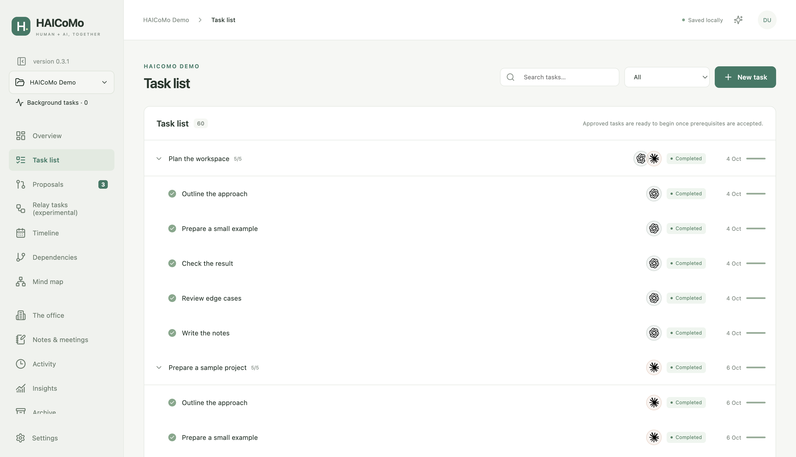
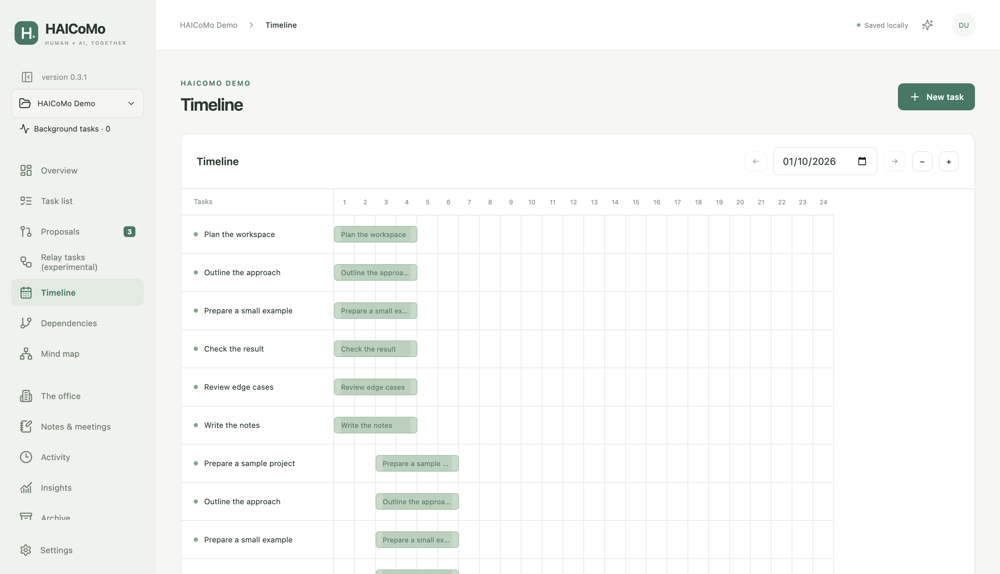
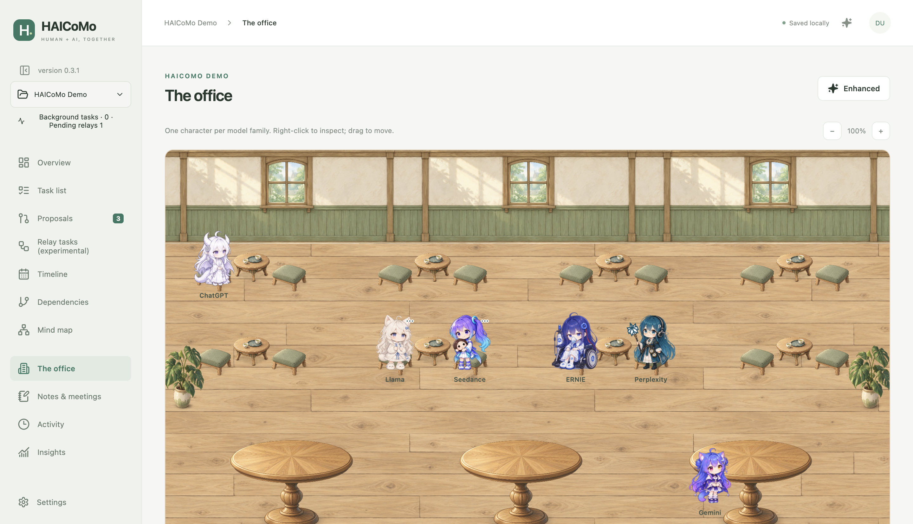
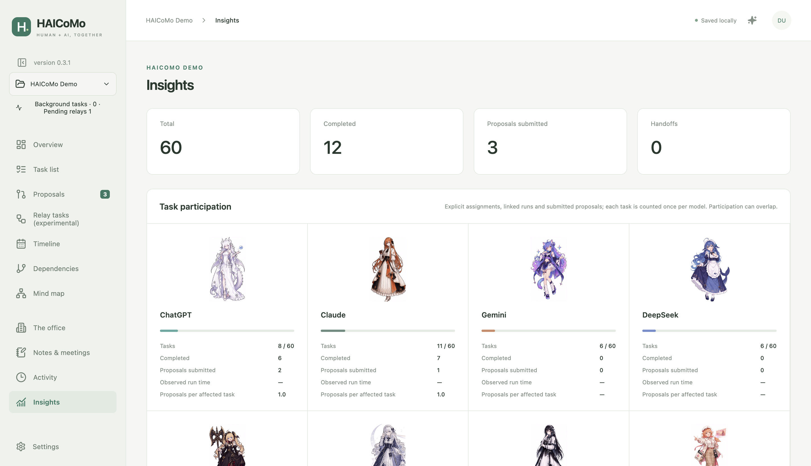
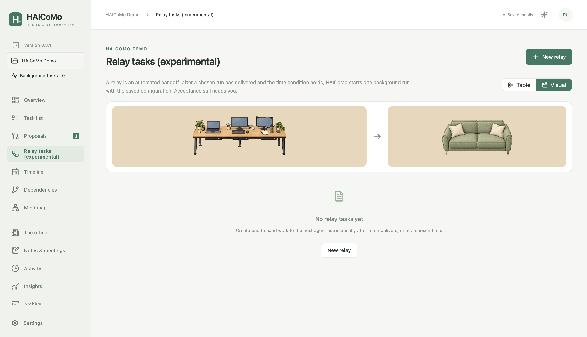
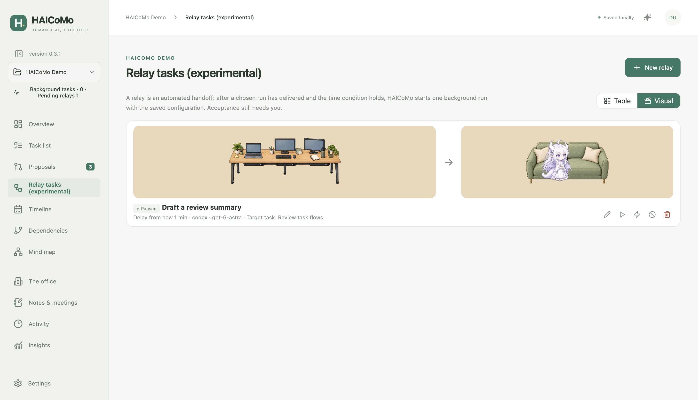

# HAICoMo

**English** · [简体中文](README.zh-CN.md)

A local desktop workspace for tasks, human review and AI collaboration. Agents propose changes; you decide what to approve and when a delivery is accepted. Project data stays in your chosen working directory.

Version **0.3.1** is a pre-release for Apple Silicon Mac and Windows x64. See the [compatibility report](docs/COMPATIBILITY-0.3.1.md) for what has actually been tested.

## Install and start

You do not need Node.js, Git or a model subscription to use the task manager.

1. Open [Downloads and releases](https://github.com/jasonyao486/HAICoMo/releases). Select **v0.3.1** and expand **Assets**.
2. Choose the installer below. The “Source code” archives are for developers, not installers.

| Your computer | Download |
|---|---|
| Mac with an Apple M-series chip | `HAICoMo-0.3.1-arm64.dmg` |
| Windows PC, System type “x64-based processor” | `HAICoMo-0.3.1-windows-x64-setup.exe` |
| Intel Mac, Windows ARM64 or Linux | No verified installer in this release |

On a Mac, find the chip under **Apple menu → About This Mac**. On Windows, open **Settings → System → About → System type**.

3. **Mac:** open the DMG, drag HAICoMo into Applications, eject the disk image, then open HAICoMo from Applications. The first release is ad-hoc signed and not notarised. If macOS blocks it, confirm you downloaded this release, then use the app-specific **Open Anyway** option in **System Settings → Privacy & Security**. Do not disable Gatekeeper globally.
4. **Windows:** open the setup `.exe`, follow the installer and launch HAICoMo. This release is unsigned and Windows may show a publisher/SmartScreen warning. Check the source and supplied SHA-256 before choosing to continue; managed computers may require administrator approval.
5. If the app opens in Chinese, first choose **设置 (Settings) → 语言 (Language) → English (UK) → 保存修改 (Save changes)**. Select **New project**, choose an empty local folder and save the `.haicomo` entry. Add a task and a subtask. No AI account is required for this step.
6. When a delivery is ready, open its file from the task, inspect it, then choose **Accept delivery**. Agent completion alone does not accept work.

For AI collaboration, install and sign into a supported client yourself. **Settings → Local agents → Detect** checks what is available. Codex and Claude Code support background handoff; other listed clients use foreground/file collaboration. HAICoMo does not provide subscriptions or switch you to paid APIs.

Updates are manual: quit HAICoMo, keep your project folders, download the next release and replace/reinstall the application. Opening a pre-0.3.1 project migrates it to schema v5 after creating a backup. Older apps cannot reopen the migrated project; restore the pre-migration backup to an empty folder if you need to go back.

Full manuals: [UK English](docs/USER-MANUAL-0.3.1.en-GB.md) · [US English](docs/USER-MANUAL-0.3.1.en-US.md) · [简体中文](docs/USER-MANUAL-0.3.1.zh-CN.md) · [繁體中文](docs/USER-MANUAL-0.3.1.zh-TW.md).

## Features

All screenshots use an isolated, synthetic “HAICoMo Demo” project with 10 tasks and 50 subtasks. They contain no real user work or account conversations.

### Tasks and subtasks

Assign models or clients, record dates and deliverables, and track prerequisites. Human acceptance unlocks dependent work.



### Revision proposals

Review proposed changes, adjust them before approval, or reject them. Revisions and transactions prevent partial approval and stale overwrites.


### Timeline, dependencies and mind map

Schedule work on the timeline. Explore dependencies or task hierarchy with zoom, fit and pan controls. Explicit model assignments display company marks.



### Collaboration studio

The default studio uses simple figures. Enhanced mode uses separately licensed character artwork and painted furniture. Animation illustrates observed state; it is not proof that an agent is working or a task is complete.




### Collaboration statistics

Inspect task participation, proposals, handoffs and observable execution time. Default and enhanced views use the same data.




### Relay preview

The visual view shows the workstation and sofa even before you create a relay. Choose default or enhanced artwork; an empty scene has no agent characters and does not start work.




### Relay, notes, activity and recovery

Experimental relay starts one background handoff after a run or time condition. It requires the app to remain running with the project loaded. Notes and meeting records stay with the project. Individual activity records can be permanently deleted after confirmation without undoing work or changing historical return counts. Backups and independent copies support recovery; backup ZIPs contain management data, not your deliverable files.



The `.haicomo` entry and hidden `.haicomo/` folder belong together. For cloud drives or Git, work locally, stop runs and relays, quit the app and complete synchronisation before changing computers. Live NAS databases and simultaneous writers are not supported. Never put private project databases or prompts in a public source repository.

## Licences and attribution

Source code and original documentation: [MIT](LICENSE). Character artwork: separate **non-commercial** permission from ZipZipPipe; whale/DeepSeek adaptations retain the original attribution chain and **CC BY-NC-SA 4.0**. Environment artwork: CC BY 4.0. Company marks are identification only, without endorsement. The complete application bundle is not wholly MIT-licensed.

Read [asset permissions](ASSET-LICENSES.md), [file-level provenance](assets/manifest.json) and [third-party notices](THIRD-PARTY-NOTICES.md) before redistributing assets. User-created content remains yours.

## Development and feedback

With Node **24.12+** and npm:

```sh
git clone https://github.com/jasonyao486/HAICoMo.git
cd HAICoMo
npm ci
npm run dev
```

`npm test` runs unit tests; `npm run test:e2e` runs Electron tests with disposable data. `npm run dist` builds the current platform; `npm run dist:win` builds Windows x64. `npm run demo -- /absolute/empty/directory` creates synthetic demonstration data. See [contributing](CONTRIBUTING.md), [architecture](docs/ARCHITECTURE.md) and [file/CLI/MCP protocol](docs/PROTOCOL.md).

[Report an issue](https://github.com/jasonyao486/HAICoMo/issues/new/choose). Remove personal paths, prompts and credentials before attaching diagnostics or screenshots. Current evidence: [tests](docs/TESTING-0.3.1.md), [review](docs/REVIEW-0.3.1.md), [first-use report](docs/FIRST-RUN-0.3.1.md), [remaining gaps](docs/GAP-ANALYSIS.md).
