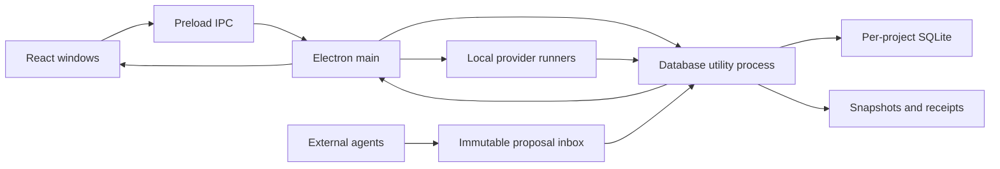

# Architecture and decisions

## ADR-001: Electron + React + TypeScript + PixiJS

Electron owns windows, file dialogs and local runner processes; React renders management controls; Pixi renders a replaceable 2D presentation. Renderer uses sandbox + contextIsolation with nodeIntegration disabled. A narrow `haicomo.request(type, payload)` preload bridge exposes business operations, never arbitrary shell or filesystem APIs.

Tauri was considered. Its smaller bundle did not offset the Rust + Node sidecar integration and separate WebView rendering work for this application. No game engine is needed for tabletop motion and sprites.

## ADR-002: one database utility process

SQLite's built-in Node binding avoids an Electron-specific native add-on rebuild. The database uses FULL synchronous rollback journalling and short BEGIN IMMEDIATE transactions. It does not rely on WAL or copying an open database file. The development Node 24.12 runtime currently includes SQLite 3.50.4; Electron ships its own runtime. This distinction must be retained in diagnostics.

Tables: one versioned project state document, durable proposal records, append-only audit, event deduplication, command idempotency. UI operation: validate → revision guard → candidate mutation → graph validation → audit/proposal update → commit → publish snapshots/receipts → broadcast. Snapshot publishing failure does not roll back a successful database commit; a warning is shown and publication can be reconstructed on open.

Only the utility process opens project databases. A per-project PID/hostname lock rejects other owners; a dead local process lock is recoverable. Remote-host locks are not guessed stale. Electron also uses an application single-instance lock. Canonical filesystem paths, not browser localStorage, address project handles.

## ADR-003: file protocol first

Independent immutable JSON proposals, SHA-256 ready markers, versioned snapshots and receipts remain usable with only filesystem access. CLI and optional MCP are adapters to the same protocol. No unauthenticated HTTP server is necessary. External events are marked self-report; only application runners can record runner source.

## ADR-004: separate state dimensions

Proposal review is not task execution; delivery is not acceptance; archive is not completion. Task completion obligations include dependencies and child tasks, with cycles checked on the combined graph. Changes to a delivered task invalidate its acceptance and any accepted parent. Direct task-return handling must preserve the same invariant.

The model family used for avatars is separate from actual provider model IDs. Aggregate priority is running → waiting → unknown → error → assigned idle → standby. Badges retain all counts so a running session cannot hide another waiting session. Heartbeats expire after 60 seconds. Only adjacent observed runner intervals, with no gap beyond 60 seconds, contribute to measured time; missed intervals are excluded. No recorded interval is displayed as unavailable rather than a fabricated duration.

Task/note entity revisions and project metadataRevision guard edits. Snapshot revision also advances for telemetry and must not be substituted for metadataRevision when changing project title/description. An editor retains its starting revision, so a second window cannot silently save over newer metadata. Task-table visibility is visual only and does not revoke acceptance. Inherited prerequisites participate in cycle detection.

The database service restarts after an unexpected exit and reopens registered projects. It does not replay unconfirmed commands. Repeated immediate crashes stop automatic recovery; manual reopening can retry. Command IDs remain the basis for safe explicit retries. Exported ZIPs are validated for allowed entries, bounded uncompressed size, SQLite integrity and matching manifest before moving into place.

## ADR-005: portability and recovery

Project-relative artifact paths survive project moves; absolute or outside-project links may need relinking. The visible `.haicomo` entry contains a relative data locator and, for new entries, project ID and epoch. It is not the backup. ZIP export uses VACUUM INTO for a consistent database snapshot and includes proposal/event files. Imports accept only the documented archive paths and bounded sizes.

New-project copies reset project identity and epoch and drop active sessions; original task IDs stay meaningful within the new identity. Existing absolute path references are not silently rewritten. External duplicates are blocked while the known original exists. Restore is never an overwrite of a live project.

## Provider boundaries

Codex App Server is launched via stdio with workspace-write and on-request approvals. Model/effort are not translated into arbitrary provider flags. Claude local CLI uses stream-json with standard permission behavior. Secrets remain in each provider's existing credential system.

Neither adapter promises to inject into an arbitrary open third-party GUI. Foreground fallback copies a properly quoted command and opens a terminal. A supported background start is never automatically retried after an uncertain RPC outcome.

## References, verified 2026-10-05

- [Electron process model](https://www.electronjs.org/docs/latest/tutorial/process-model)
- [Codex App Server](https://learn.chatgpt.com/docs/app-server)
- [Claude programmatic CLI](https://code.claude.com/docs/en/headless)
- [Pixi renderers](https://pixijs.com/8.x/guides/components/renderers)
- [SQLite backup](https://www.sqlite.org/backup.html)
- [HAICO](https://github.com/fuzihaofzh/haico): architectural reference only; README/package MIT label but no root license text found during research.
- [Pixel Office](https://github.com/basriayaz/pixel-office): MIT text verified, no implementation code copied into this app.

## ADR-006: v2 identities and bounded work

Clients are a registry independent of model families. Task assignees may target humans, families or clients; actual run identity resolves to a family only when known, otherwise the client retains its icon. Source type distinguishes trusted app runner telemetry from file self-reports; neither authenticates an arbitrary process with filesystem write access.

V1 migration takes a consistent archive before writing a v2 transaction and retains immutable raw input. Startup ingestion is capped at 200 files per batch; watch notifications plus periodic metadata reconciliation avoid rereading all historical content every tick. UI lists use server-side pages while metrics use complete persisted history. Date-only and visibility changes preserve acceptance; deliverable changes require renewed acceptance.

Office geometry, navigation and seat ownership are presentation-only. Independent PNG furniture and character regions share depth ordering; a 1120×740 logical viewport scrolls a taller world and culls offscreen objects. Runtime statistics exclude decorative activity. Renderer loss leaves the status list and management usable.

Updates are event-driven through a controller with injected backend. Download/install are distinct actions; auto-download, auto-install-on-quit and downgrade are disabled. HTTPS is required outside explicit loopback test mode. No configured public feed means not-configured, not success.

## ADR-007: bound tabs and explicit file lifecycle (0.2.1)

A native window owns multiple retained React tab trees. Each has a stable binding to a project identity and epoch; IPC captures that binding before asynchronous work. The main process shares one worker store across views of the same project, retains stores needed by active runners, and routes file-open events into the existing window. Hidden offices stop their Pixi tickers. Tab close and native close/quit run save/discard/cancel guards. Review drafts are local UI data keyed by project/epoch/proposal; saving them does not approve a proposal.

Normal opens validate the actual entry on every request rather than trusting recents or the store cache. A journalled staging transaction archives orphaned old data before fresh creation and publishes the new entry last. Rollback only removes the transaction's own staged identity. Moved connections release only their matching writer token; this process may reclaim a moved token only after its own connection has closed. Concurrent startup/discovery blocks replacement, with identity checked again before spawning a runner.

Settings normalise legacy paths into clientPaths; empty entries deliberately override old values. Structured error objects cross each process boundary; localization/formatting occurs in the UI. Current session lifecycle is independent of task acceptance and archive. Schema-3 migration uses a consistent backup and preserves the historical unknown outcome of old runner records.

## ADR-008: relay scheduler (0.3.0)

Relays live in the project state (schema v4) and are evaluated by a main-process `RelayScheduler` with injected hooks (directories, view, command, start). Evaluation is serialized; triggers are a 20 s interval, every runner history event, system resume and project open. A relay is claimed in the database (`relay.claim`, revision-guarded) before any process is spawned, so a crash between claim and spawn leaves a visible `firing` relay rather than a duplicate send; start failures become `failed` and are never retried automatically. Delivery means a runner session in `history` with `endReason=completed`; permission, failure, cancellation, loss or untracking block the relay for a human decision. A due time that passed before the scheduler was alive (launch or resume, beyond a ten-minute grace) is `missed`.

The scheduler only sees directories the app has open; pending relays keep their store open after the tab closes and are listed under background tasks. Human relay commands come through the same binding-scoped IPC as other commands; the renderer cannot issue system transitions. Capability checks (background support, mode catalogue, effort) and project identity are re-verified at fire time, and the composed prompt (with the reference task's recorded deliverables) is stored verbatim in the handoff record.

Telemetry publication: committed runner events for current runs defer `snapshot.json`/receipt writes by two seconds; commands, lifecycle events, ingestion and close flush immediately. Attribution metrics use a cached slim projection of proposals keyed on proposal changes and a tasks/sessions signature.

Windows launch: npm `.cmd` shims are parsed for their JavaScript entry and run with a Node runtime (`ELECTRON_RUN_AS_NODE=1` inside the app), keeping the no-shell-interpolation rule. A tray appears on Windows/Linux only while agents or pending relays would otherwise run headless.

## ADR-009: v5 activity deletion, portable references and public release

Audit activity is a human-editable presentation history. The only former audit-derived business metric, acceptance returns, is now durable `historyStats` project state. A pre-v5 archive precedes the transactional migration; a one-record human deletion cannot rewrite proposals, receipts, tasks, acceptance or old backups. Command hashes retain idempotency without retaining the deleted audit payload. This is logical deletion, not secure disk erasure or an immutable compliance log.

`shared/artifact-path.ts` normalises new and legacy separators and annotates external references for prompts. The core resolver applies host-platform rules and rejects foreign absolute paths. It is shared by reveal and handoff flows; no automatic relocation of external files is inferred.

Pure graph layout functions are shared-testable and have no renderer imports. Hierarchical subtrees and topological dependency layers are packed by independent components. Explicit family assignments produce deduplicated company marks. The renderer controls zoom/pan without persisting presentation as business state.

Only `assets/runtime` is a Vite public directory, checked against a hash manifest before build. Legal notices distinguish MIT application code, non-commercial character adaptations, CC environment artwork and marks. Manual GitHub downloads are the default release channel; updater infrastructure is not configured as a trusted automatic-install service.
