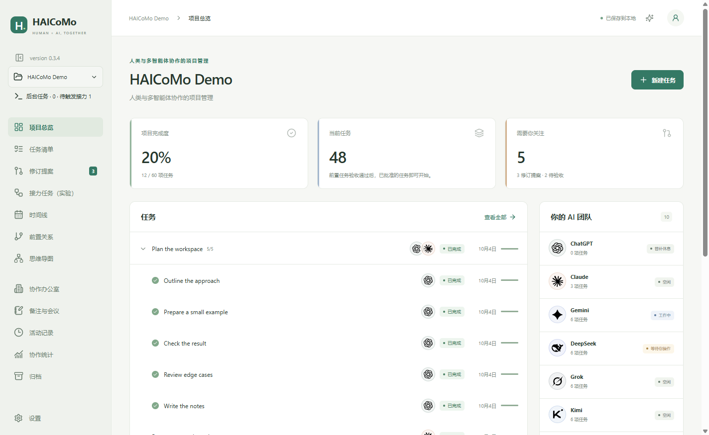

# HAICoMo 0.3.4 Windows 升级与发布验证

本报告记录同一份 Windows CI 安装包的验证、本机升级及后续公开下载核验；中间失败及其修复单独保留。

## 源码与 CI

- 源码：`8e6ac378d7f7db5b6a62719ce1eae5702299da12`，由 [PR #1](https://github.com/jasonyao486/HAICoMo/pull/1) 和 [PR #2](https://github.com/jasonyao486/HAICoMo/pull/2) 合入 main。
- [最终 PR 原生验证 37673211594](https://github.com/jasonyao486/HAICoMo/actions/runs/37673211594)：Windows 90 项单元通过、2 项 Mac 专用跳过；源码与打包桌面测试各 25/25；安装后测试 4/4；真实普通账户安装、重装、0.3.3 升级、卸载及数据保留通过。
- 同一 PR 的 Mac CI：92 项单元通过；源码及未签名打包桌面各 23 通过、2 项 Windows 专用跳过。这是模拟客户端的自动化回归，不代表 Mac 真实账号或新版本签名、公证验收；本次不发布 Mac 0.3.4。
- 本机 Windows 25H2 x64 build 26200.9457，Node 24.21.0：资源、类型及公共源码检查通过；90 项单元通过、2 项跳过，源码桌面 25/25。
- [主分支 Windows 发布验证 37675096047](https://github.com/jasonyao486/HAICoMo/actions/runs/37675096047)：全部通过。90 项单元通过、2 项 Mac 专用跳过；源码及打包桌面各 25/25，安装后测试 4/4；真实普通账户 0.3.3 升级、重装、卸载、数据保留及受保护注册表拒写均通过。

## 发布准备期间发现并修复的问题

| 问题与证据 | 分类 | 修复及回归 |
| --- | --- | --- |
| [第一次主分支 CI](https://github.com/jasonyao486/HAICoMo/actions/runs/37669497273) 关闭应用后残留 writer.lock | 跨平台退出缺陷，在 Windows 验证中发现 | 旧代码在 1.5 秒后强制杀数据库服务。让恢复后的测试 worker 延迟 2 秒关闭，在本机确定复现旧失败；改为等待既有关闭请求确认，并阻止退出重入。修复后同一用例独立 3/3，本机完整套件及最终双平台 CI 通过 |
| 同一 CI 中终端进程观察超时，后续 EBUSY 清理错误遮蔽初始失败 | Windows 测试设施缺陷 | 冷启动 WMI 查询超过观察期限，PID 未记录导致终端未清理。改用只读原生 Toolhelp 快照；失败后仍寻找测试所有的子进程并清理其控制台树，单列清理错误。不增加断言超时、不增加 retry；独立 3/3 及最终 Windows CI 通过 |
| [中间 Mac CI](https://github.com/jasonyao486/HAICoMo/actions/runs/37671811094) 恢复标签后 Ctrl+Tab 使所有项目页面隐藏 | 跨平台界面时序缺陷，不是 Windows 独有回归 | 旧键盘回调闭包持有恢复前列表。通过保留初始回调，在 Windows 确定复现同一失败；改为读取已有 current-tabs ref。原生快捷键、保留回调、正反切换均断言，修复后独立 3/3 及最终双平台 CI 通过 |

中间失败日志和轨迹保留；发现新问题后修复代码／测试再验证，没有将失败运行改记为成功。Mac 这次有原生 CI 证据，但没有新的真实账号、签名、公证或用户首次打开验收。

## 本机升级与同一产物验证

- 从上述主分支运行下载 `haicomo-0.3.4-windows-x64`，逐项核对 `SHA256SUMS-win32-x64.txt` 及普通账户验收中的安装包哈希；没有重新构建或修改待发布文件。
- 2026-10-07 19:47:53 UTC 完成当前用户 0.3.3 → 0.3.4 原位升级，安装程序退出码 0。路径保持 `%LOCALAPPDATA%\Programs\haicomo\HAICoMo.exe`。
- 实际程序 `app.getVersion()`、界面和卸载注册均为 0.3.4；EXE FileVersion 为 0.3.4，ProductVersion 为 0.3.4.0。开始菜单快捷方式与 `.haicomo` 默认打开命令指向正确安装路径。
- 安装前正常应用未运行；备份位于 `%LOCALAPPDATA%\HAICoMo-dev\backups\before-0.3.4-20261007-193909`。升级后逐文件复核原有 58 个用户配置文件，全部哈希不变；原版官方 0.3.3 安装包和校验清单保留用于回退。
- 使用实际安装的 EXE、独立配置和临时项目：完整桌面 25/25 通过；原后台交接场景独立连续 3/3（24.2 秒），保留启动、并发权限及结束断言，没有 retry。
- 实机发现 Codex CLI 0.153.4、Claude Code 2.1.285、Claude 商店桌面和 Cursor 桌面；Cursor 保持手动交接能力，未误报后台支持。原生终端、托盘恢复等包含在安装后完整套件中。
- 实际安装包的真实 Codex 订阅会话通过文件生成、原会话恢复、取消确认；界面后台数量回到 0、活动中存在交接记录，人工验收没有被自动执行。真实任务未触发权限询问，权限交互仍由模拟用例覆盖。原始证据保留在被 Git 忽略的 `validation/windows-functional/release-034-installed/codex/`，不公开账号会话日志。
- 已检查下面的实际安装窗口截图，仅包含合成演示项目。安装和启动没有遇到系统安全阻断；安装包签名状态为 `NotSigned`。

安装包 SHA-256：`ec434afc81f2342082d57d1f2e61ddd528dadd606886a16627845979b3e33f9e`。

## 发布与限制

- [发布工作流 37677874919](https://github.com/jasonyao486/HAICoMo/actions/runs/37677874919) 通过，2026-10-07 19:54:16 UTC 公开 [v0.3.4 Windows preview](https://github.com/jasonyao486/HAICoMo/releases/tag/v0.3.4)，晚于本机安装和功能验收。
- 标签指向上述已验证源码提交。公开附件只有 Windows 安装包、blockmap、Windows 校验清单及普通账户验证 JSON；没有重新构建上传文件。
- 发布工作流与本机均匿名重新下载并验证公开附件。本机公开下载得到的安装包 SHA-256 与实际用于升级的 CI 安装包完全相同。
- 对比发布前后 v0.3.3 的文件名、大小及 GitHub SHA-256 digest，8 个历史附件全部不变；保留 Mac 0.3.3 的签名、公证下载和 Windows 0.3.3 回退包。
- 中英文 README 推荐 Windows 0.3.4、Mac 0.3.3，并分别指向正确发布页及平台安装包。升级后的日常 HAICoMo 已启动，测试项目与日常配置保持隔离。
- 本机证据位于被 Git 忽略的 `validation/release-0.3.4/`：安装前后配置哈希、候选包／公开下载、安装信息、客户端发现、完整安装后套件、三次后台交接及全部失败／成功日志。公开报告和截图仅使用合成项目。

Windows 仍未签名，自动更新未配置。Claude 的交互权限和取消确认、Cursor 的手动交接范围保持 [Windows 功能报告](TESTING-WINDOWS-2026-10-07.md) 所述限制。两项 Mac 专用单元跳过的名称及原因也见该报告。公共 checkout 不含原始私有 `prd_draft.md`，无法复核其哈希；没有生成或修改该文件。

文件关联本轮验证注册目标；未新增 Explorer 鼠标双击观察。托盘回归使用真实 Tray 及其 click 处理器，未新增通知区鼠标点击观察。真实 Claude／Cursor 任务沿用前一阶段证据，不把模拟 CI 或客户端识别冒充新的真实账号验收。
